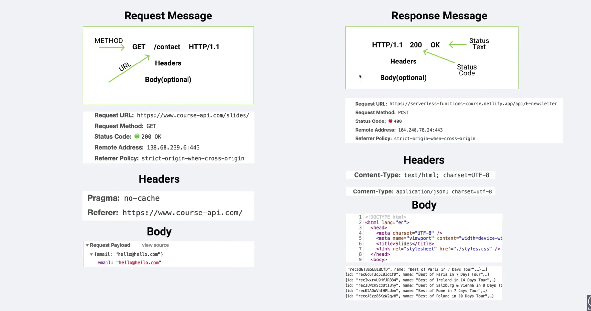
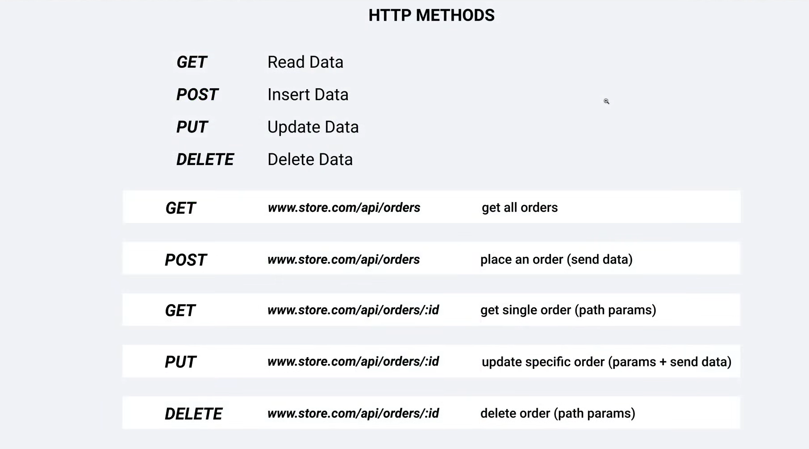

⭐️ Repository Contents ⭐️

- Introduction 
- What Is Node 
- Course Requirements 
- Course Structure 
- Browser Vs Server 
- Install Node 
- Repl 
- Cli 
- Source Code 
- Globals 
- Modules Setup 
- First Module 
- Alternative Syntax 
- Mind Grenade 
- Built-In Module Intro 
- Os Module 
- Path Module
- Fs Module (Sync)
- Fs Module (Async)
- Sync Vs Async
- Http Intro
- Http Module (Setup)
- Http Module (More Features)
- NPM Info
- NPM Command
- First Package
- Share Code
- Nodemon
- Uninstall
- Global Install
- Package-Lock.Json
- Important Topics Intro
- Event Loop
- Event Loop Slides
- Event Loop Code Examples
- Async Patterns - Blocking Code
- Async Patterns - Setup Promises
- Async Patterns - Refactor To Async
- Async Patterns - Node's Native Option
- Events Info
- Events Emitter - Code Example
- Events Emitter - Additional Info
- Events Emitter - Http Module Example
- Streams Intro
- Streams - Read File
- Streams - Additional Info
- Streams - Http Example
- End Of Node Tutorial Module
- HTTP Request/Response Cycle
- Http Messages
- Starter Project Install
- Starter Overview
- Http Basics
- Http - Headers
- Http - Request Object
- Http - Html File
- Http - App Example
- Express Info
- Express Basics
- Express - App Example
- Express - All Static
- API Vs SSR
- JSON Basics
- Params, Query String - Setup
- Route Params
- Params - Extra Info
- Query String
- Additional Params And Query String Info
- Middleware - Setup
- APP.USE
- Multiple Middleware Functions
- Additional Middleware Info
- Methods - GET
- Methods - POST
- Methods - POST (Form Example)
- Methods - POST (Javascript Example)
- Install Postman
- Methods - PUT
- Methods - DELETE
- Express Router - Setup
- Express Router - Controllers

# Backend/Full-stack

- Node and Express Fundamentals
- Complex REST API
- MERN App
- More Projects

## Node JS Pack

- Node Fundaments
- Express.js
- Mongo DB, Mongoose
- Applications
- Deployment

## About Node JS 

- Environment to run JS outside Browser
- Built on Chrome's v8 JS Engine
- Big Community
- Full-stack

## Pre-requests

- HTML, CSS, JS, ES6
- Callbacks, Promises, Async-Await

## Node JS Setup

- Intro
- Install
- Node Funcdamentals
- Express Tutorial
- Building Apps....

## Client browser & Server node.js comparision

| Browser | Node.js |
|---------|---------|
| Dom | No Dom |
| window | No window |
| Interactive Apps | Server side apps |
| No Filesystem | Filesystem |
| Fragmentation | Versions |
| Es6 Modules | CommonJS |

## REPL CLI [Read-Eval-print Loop]

```bash
node
const name = "Yogesh";
name
```

## Globals - No Window

__dirname  - path to current directory
__filename - file name
require    - function to use modules (CommonJS)
module     - info about current module (file)
process    - info about env where the program is being executed

## Built-in Modules 

- OS
- Path
- FS
- Http

## NPM setup

```bash
// npm - global command, comes with node
npm --version

// local dependency - use it only in this particular project
npm i <packageName>

// global dependency - use it in any project
npm install -g <packageName>
sudo i -g <packageName> // (linux, mac)

npm init
```


## Async Patterns

- Promise
- Resolve
- Reject

## Events

- Event-driven programming
- used heavily in Node.js

## Streams

- Writable
- Readable
- Duplex
- Transform

## HTTP request/respose Cycle

- Request & Response slide


- HTTP Methods


## Express.js

| API | SSR |
|-----|-----|
|API -JSON | SSR - Temaplate|
|Send Data | Send Template | 
|Res.json() | Res.render() |

